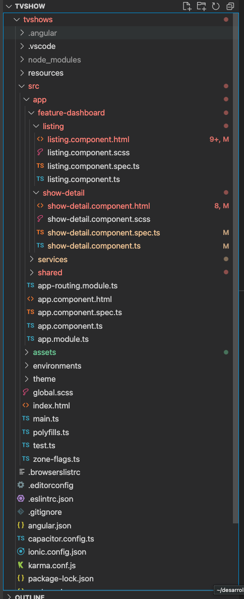

## Overview

The TV Shows App consists of the following main features:
1. **Listing**: Displays a list of TV shows.
2. **Show Detail**: Provides detailed information about a selected show, including its image and name.
3. **Dark Theme**: Provides ability to switch between default and dark theme.



## Technology Stack

- **Ionic** - This app uses the latest version of Ionic for the UI components.
- **Angular** - Underlying framework for building the app.

## Design Considerations

1. **Ionic Defaults**: Throughout the app development, there has been a strong emphasis on using Ionic's default components. This ensures that the app maintains a consistent look and feel that users are familiar with when using an Ionic application.
2. **Pure CSS**: To maintain simplicity and stick to the challenge instructions, only pure CSS was used for styling. There aren't any external UI libraries or frameworks added for styling purposes.
3. **Preference for Better UI Libraries**: While the app sticks to Ionic defaults and pure CSS for this challenge, it's worth mentioning that given a choice, leveraging more advanced UI libraries would be preferred for enhanced UI/UX.

## Project Structure

\```plaintext
src
├── app
│   ├── feature-dashboard
│   │   ├── listing
│   │   ├── show-detail
│   │   └── services
│   ├── shared
│   ├── app-routing.module.ts
│   ├── app.component.html
│   ├── app.component.spec.ts
│   ├── app.component.ts
│   └── app.module.ts
├── assets
├── environments
├── theme
├── global.scss
├── index.html
├── main.ts
├── polyfills.ts
\```

## Getting Started

1. Clone the repository.
2. Navigate to the project directory.
2. If you have nvm, please run nvm use.
3. Install the dependencies:
    \```bash
    npm install
    \```
4. Run the app locally:
    \```bash
    ionic serve
    \```

## Contribution

If you have suggestions or would like to contribute to this project, feel free to open a pull request or issue. Your feedback is
